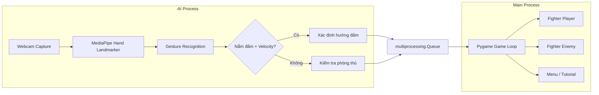

# 🥊 DIPR Boxing — AI Hand-Tracking Fighting Game

> **Trải nghiệm boxing ngay trên bàn phím — hoặc bằng chính nắm đấm của bạn!**

**DIPR Boxing** là một game đối kháng boxing góc nhìn thứ nhất (FPS), nơi người chơi điều khiển nhân vật bằng **cử chỉ tay thực tế qua webcam** hoặc bàn phím. Hệ thống AI sử dụng **MediaPipe Hand Landmarker** để nhận diện nắm đấm, hướng đấm và tư thế phòng thủ trong thời gian thực.

---

## ✨ Tính năng chính

| Tính năng | Mô tả |
|---|---|
| 🤛 **Nhận diện cử chỉ tay** | Phát hiện nắm đấm, hướng đấm (trái/phải/thẳng) và phòng thủ qua webcam |
| 🎮 **Hỗ trợ bàn phím** | Điều khiển bằng phím `A` / `D` / `W` / `S` nếu không có webcam |
| ⚡ **120 FPS mượt mà** | Game loop chạy ở 120 FPS cho trải nghiệm chiến đấu cực mượt |
| 🧠 **AI Multiprocessing** | Module AI chạy trên process riêng, không ảnh hưởng hiệu suất game |
| 🎨 **Sprite Animation** | Hệ thống animation spritesheet cho cả player và enemy |
| 🛡️ **Hệ thống combat** | Hit detection, counter hit (x1.5 damage), và cơ chế phòng thủ |

---

## 📁 Cấu trúc Project

```
DIPR-Project/
├── hand_landmarker.task        # Model MediaPipe Hand Landmarker
├── README.md
└── DIPR_Game/
    ├── main.py                 # Entry point — game loop, menu, rendering
    ├── ai_controller.py        # AI process — webcam + MediaPipe hand tracking
    ├── fighter.py              # Class Fighter — quản lý animation & state
    ├── spritesheet.py          # Utility load spritesheet từ file PNG
    ├── setting.py              # Cấu hình game (đang phát triển)
    ├── combat/
    │   └── hit_detection.py    # Logic phát hiện va chạm & tính damage
    ├── assets/
    │   ├── bg/                 # Background image
    │   ├── player/             # Spritesheet nhân vật (Idle, LP, RP, SP, def)
    │   └── enemy/              # Spritesheet đối thủ (Idle, LP, RP, SP, def, GH*)
    └── mp_env/                 # Python virtual environment
```

---

## 🚀 Cài đặt & Chạy

### Yêu cầu hệ thống

- **Python** 3.12+
- **Webcam** (tùy chọn — có thể chơi bằng bàn phím)
- **Windows** (đã test) / macOS / Linux

### 1. Clone repository

```bash
git clone https://github.com/BapVitHoang/boxing-tracking-game.git
cd boxing-tracking-game
```

### 2. Tạo virtual environment & cài dependencies

```bash
python -m venv DIPR_Game/mp_env
```

**Kích hoạt virtual environment:**

```bash
# Windows
DIPR_Game\mp_env\Scripts\activate

# macOS / Linux
source DIPR_Game/mp_env/bin/activate
```

**Cài đặt thư viện:**

```bash
pip install pygame opencv-python mediapipe numpy
```

### 3. Chạy game

```bash
cd DIPR_Game
python main.py
```

> 💡 **Lưu ý:** File `hand_landmarker.task` (model MediaPipe) phải nằm cùng thư mục gốc project. Game sẽ tự động mở webcam khi bắt đầu.

---

## 🎮 Hướng dẫn chơi

### Điều khiển bằng cử chỉ tay (AI Controller)

| Hành động | Cử chỉ |
|---|---|
| 🤜 **Đấm trái** | Nắm tay trái và đấm nhanh |
| 🤛 **Đấm phải** | Nắm tay phải và đấm nhanh |
| 👊 **Đấm thẳng** | Đấm thẳng vào giữa camera |
| 🛡️ **Phòng thủ** | Đưa cả hai tay lên che mặt (hai cổ tay gần nhau) |

### Điều khiển bằng bàn phím

| Phím | Hành động |
|---|---|
| `A` | Đấm trái (Left Punch) |
| `D` | Đấm phải (Right Punch) |
| `W` | Đấm thẳng (Straight Punch) |
| `S` (giữ) | Phòng thủ (Defend) |
| `ESC` | Quay lại Menu |
| `↑` / `↓` | Di chuyển trong Menu |
| `Enter` | Chọn trong Menu |

---

## 🏗️ Kiến trúc hệ thống



### Luồng xử lý chính

1. **AI Process** (`ai_controller.py`) chạy trên process riêng biệt, liên tục đọc frame từ webcam
2. **MediaPipe Hand Landmarker** phân tích 21 điểm landmark trên mỗi bàn tay
3. **Gesture Recognition** xác định:
   - **Nắm đấm**: So sánh khoảng cách đầu ngón tay vs. khớp MCP đến cổ tay
   - **Tốc độ đấm**: Tính velocity giữa các frame (ngưỡng > 0.12)
   - **Hướng đấm**: Dựa vào vị trí cổ tay (trái/phải/giữa camera)
   - **Phòng thủ**: Khoảng cách giữa 2 cổ tay < 0.25
4. **Command Queue**: Lệnh được gửi qua `multiprocessing.Queue` đến Main Process
5. **Game Loop** (120 FPS) nhận lệnh và cập nhật animation tương ứng

---

## 🛠️ Tech Stack

| Công nghệ | Vai trò |
|---|---|
| [**Pygame**](https://www.pygame.org/) | Game engine — rendering, animation, input |
| [**MediaPipe**](https://developers.google.com/mediapipe) | Hand landmark detection (21 điểm/tay) |
| [**OpenCV**](https://opencv.org/) | Webcam capture & hiển thị camera feed |
| [**NumPy**](https://numpy.org/) | Xử lý dữ liệu ảnh |
| **Python Multiprocessing** | Chạy AI trên process riêng, tránh block game loop |

---

## 🔧 Cấu hình

Các thông số AI có thể tùy chỉnh trong [ai_controller.py](DIPR_Game/ai_controller.py):

```python
VELOCITY_THRESHOLD = 0.12    # Ngưỡng tốc độ để nhận diện cú đấm
GUARD_DISTANCE = 0.25        # Khoảng cách tối đa giữa 2 cổ tay để phòng thủ
MIN_FOLDED_FINGERS = 3       # Số ngón tay gập tối thiểu để nhận diện nắm đấm
```

Cấu hình game trong [main.py](DIPR_Game/main.py):

```python
WIDTH, HEIGHT = 1500, 700    # Kích thước cửa sổ game
FPS = 120                    # Frame rate
```

---

## 📸 Screenshots

> *Sẽ được cập nhật sớm...*

---

## 🤝 Đóng góp

1. Fork repository
2. Tạo branch mới: `git checkout -b feature/ten-tinh-nang`
3. Commit changes: `git commit -m "Add: mô tả thay đổi"`
4. Push lên branch: `git push origin feature/ten-tinh-nang`
5. Tạo Pull Request

---

## 📄 License

Project này được phát triển cho mục đích học tập và nghiên cứu (DIPR Course Project).

---

<div align="center">

**Made with 🥊 by DIPR Team**

</div>